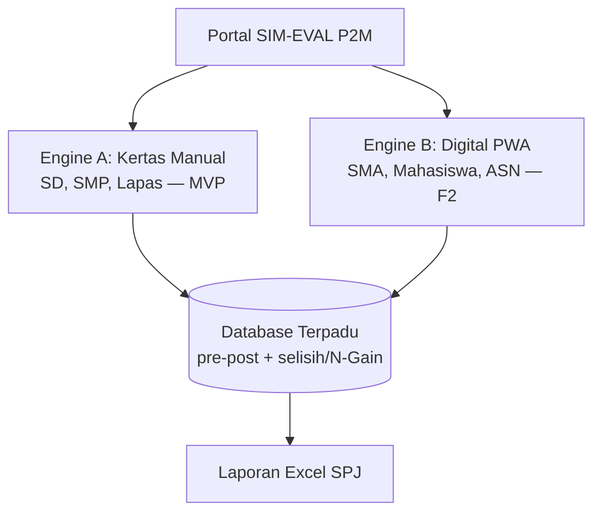
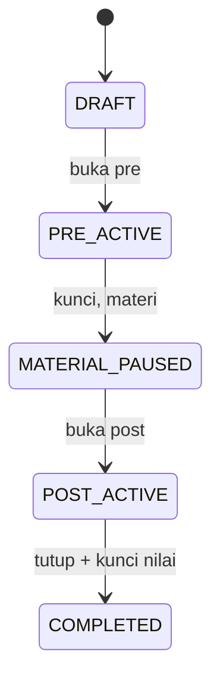
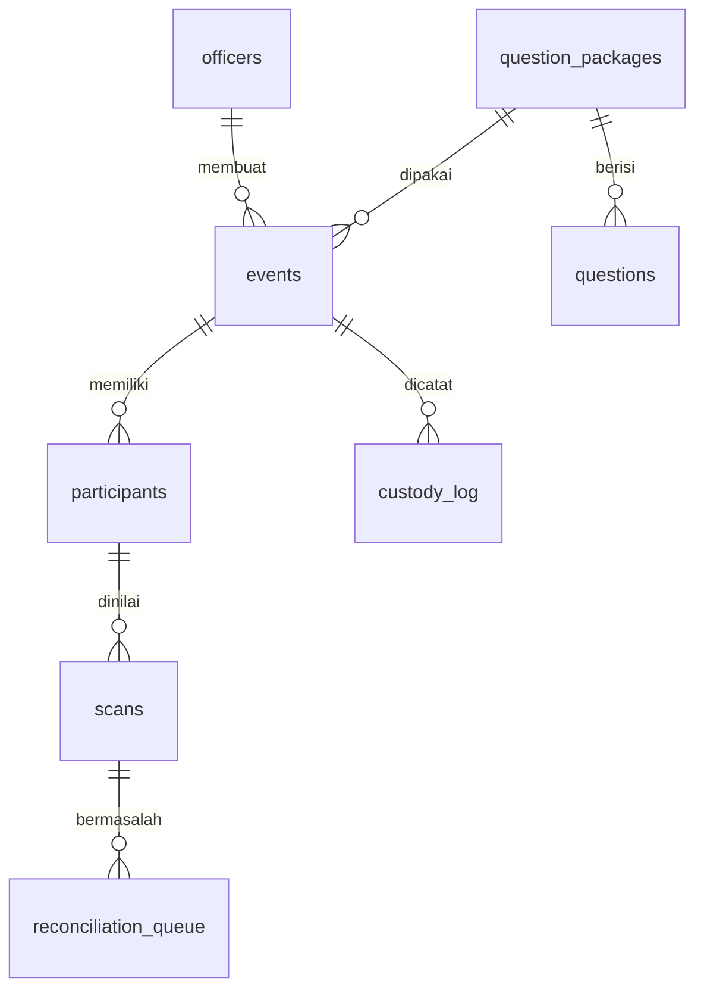

# SIM-EVAL P2M — Blueprint Sistem v2.0

## Sistem Informasi Monitoring & Evaluasi Pre-Test / Post-Test Sosialisasi Terpadu
### Seksi Pencegahan dan Pemberdayaan Masyarakat (P2M) BNN

| Atribut | Isi |
|---|---|
| Status dokumen | **Final untuk presentasi stakeholder** |
| Versi | 2.0 (konsolidasi: Final v1.0 + Revisi MVP v1.1) |
| Tanggal | September 2026 |
| Penulis | Tim Magang SIM-Eval |
| Arsip pendahulu | `SIM-EVAL_P2M_Blueprint_Final.md` (v1.0), `SIM-EVAL_P2M_Blueprint_Revisi-MVP.md` (v1.1) — tetap disimpan, tidak dihapus |
| Cara baca untuk stakeholder awam | Cukup baca Bab 1–5. Sisanya untuk pengembang. Istilah sulit dijelaskan di Glosarium (Bab 2). |
| Tanda khusus | **[PR]** = wajib dikonfirmasi saat presentasi. **[MVP]** = masuk versi pertama. **[F2]/[F3]** = ditunda ke fase berikutnya. |

### Riwayat versi

| Versi | Tanggal | Perubahan |
|---|---|---|
| 1.0 Final | 2026 | Desain dual-engine awal: barcode unik per lembar, larang fotokopi, N-Gain sebagai formula utama |
| 1.1 Revisi MVP | 2026 | 8 keputusan diskusi: fotokopi boleh tanpa nomor, scan+ketik berurutan, pairing nama + layar pengecualian, SMP→manual, selisih default + N-Gain opsi, amplop Lapas, satu akun + hosting sementara |
| **2.0 (dokumen ini)** | 2026 | **Konsolidasi penuh dan mandiri.** Semua bab ditulis lengkap (bukan delta). Tambahan: soal dummy 5 butir, Engine B fleksibel (nama diinput saat join/koreksi), perbaikan skema DB, estimasi waktu, acceptance criteria, risiko, matriks peran, contoh template & pemetaan Excel |

---

## Daftar isi

1. Ringkasan eksekutif
2. Glosarium
3. Latar belakang, tujuan, ruang lingkup, stakeholder, asumsi
4. Kebijakan operasional baku & SOP lapangan
5. Arsitektur sistem
6. Engine A — mode kertas manual [MVP]
7. Engine B — mode digital fleksibel [F2, dirancang di v2.0]
8. Model data
9. Logika evaluasi
10. Laporan Excel SPJ
11. Keamanan, peran, privasi, operasional non-fungsional
12. Lapas — perlakuan khusus
13. Diferensiasi, estimasi, acceptance criteria, risiko
14. Roadmap & agenda validasi presentasi
- Lampiran A: paket soal dummy
- Lampiran B: contoh amplop & daftar hadir

---

## 1. Ringkasan eksekutif

SIM-EVAL P2M mendigitalisasi evaluasi pre-test/post-test penyuluhan P4GN tanpa mengubah kebiasaan lapangan: petugas tetap fokus mendampingi acara, kertas tetap kertas, dan semua kerja digital dilakukan **setelah kertas terkumpul**.

Tiga masalah yang diselesaikan: (1) beban koreksi manual dan salin nilai ke Excel di luar jam kegiatan, (2) audiens tanpa gawai (siswa SD) atau tanpa izin gawai (warga binaan Lapas, area blankspot), (3) laporan yang sah administratif untuk SPJ dan siap diaudit.

Keputusan arsitektur v2.0:

- **[MVP] SD dan SMP = kertas polos fotokopi + aplikasi scan+ketik.** Tanpa nomor unik, tanpa barcode. Identitas = nama tulis tangan yang diketik operator sekali saat pre-test, lalu dicari saat post-test.
- **[F2] SMA / mahasiswa / ASN = PWA digital (QR atau kode join).** Nama diinput fleksibel saat join (lihat Bab 7) — tidak bergantung pada daftar H-1.
- **Rumus utama MVP = selisih (Post − Pre).** N-Gain tersedia sebagai opsi, bukan kewajiban.
- **Lapas = amplop dibawa ke kantor.** Tanpa HP di dalam area tahanan.
- **MVP = satu akun bersama + hosting sementara.** Akun per penyuluh dan server dinas menyusul.

Yang disengaja TIDAK ada di MVP: barcode/QR per lembar, penanda ArUco, pemrosesan citra presisi, penguncian HP peserta, multi-akun. Semua dijadwalkan Fase 2–3 agar masa magang selesai dengan satu alur yang terbukti jalan di satu sekolah.

---

## 2. Glosarium (bahasa awam)

| Istilah | Arti singkat |
|---|---|
| SPJ | Surat Pertanggungjawaban — berkas laporan kegiatan dinas, wajib ada daftar hadir + rekap nilai + tanda tangan pejabat |
| Pre-test / Post-test | Kuis pendek yang sama sebelum dan sesudah materi, untuk mengukur kenaikan pemahaman |
| Selisih (delta) | Post dikurangi Pre. Contoh: 60→80 berarti naik 20 poin |
| N-Gain (Hake) | Rumus akademis `(Post−Pre)/(100−Pre)` + kategori Tinggi/Sedang/Rendah. Adil untuk kelas dengan nilai awal beda, tapi lebih sulit dijelaskan |
| OMR | Cara komputer membaca centangan di kertas lewat foto (bukan membaca tulisan tangan) |
| PWA | Aplikasi web yang bisa dibuka di HP tanpa instal dari Play Store, dan bisa dibuka ulang tanpa internet setelah pertama dibuka di kantor |
| IndexedDB / localStorage | Tempat simpan sementara di HP/laptop sendiri sebelum dikirim ke server pusat |
| ADF | Mesin scanner/fotokopi kantor yang bisa menelan banyak kertas sekaligus jadi satu file PDF |
| Custody log | Catatan siapa membawa amplop kertas dari mana ke mana dan kapan (khusus Lapas) |
| Rekonsiliasi / pengecualian | Proses mencocokkan pre-post; "pengecualian" = daftar nama bermasalah yang harus dicek manusia |
| Join code | Kode pendek 6 huruf/angka (contoh `K7Q2M9`) untuk masuk kuis digital bila QR/proyektor mati |

---

## 3. Latar belakang, tujuan, ruang lingkup, stakeholder, asumsi

### 3.1 Masalah operasional

1. **Beban klerikal.** Penyuluh memeriksa 35–50 lembar manual dan menyalin nilai satu per satu ke Excel di luar jam kegiatan.
2. **Keterbatasan gawai.** Siswa SD tidak membawa HP. Warga binaan Lapas dilarang membawa perangkat elektronik; sinyal sering blankspot/jammer.
3. **Etika pendampingan.** Personel di lokasi mendampingi narasumber dan menertibkan audiens — tidak ideal mengoperasikan gawai saat acara.
4. **Akuntabilitas.** Data evaluasi harus sinkron dengan daftar hadir resmi untuk lampiran SPJ dan siap diaudit BPK/Inspektorat.

### 3.2 Tujuan (terukur untuk MVP)

1. Satu kelas (±35 anak) selesai dari amplop terkumpul sampai Excel keluar dalam ±35 menit oleh 1 operator. **[MVP]**
2. Tidak ada nilai tertukar diam-diam: setiap keraguan nama/Jawaban muncul di layar pengecualian. **[MVP]**
3. Laporan Excel mengikuti format resmi P2M dan memakai rentang dinamis. **[MVP]**
4. Alur Lapas tanpa HP di dalam area tahanan. **[MVP]**

### 3.3 Ruang lingkup

**Masuk MVP:** buat event, template kertas fotokopi, scan+ketik pre/post berurutan, layar pengecualian, hasil + rata-rata, unduh Excel, sinkron manual offline, custody sederhana, satu akun.
**Keluar MVP (F2/F3):** barcode unik, ArUco/OpenCV.js presisi, Engine B penuh, multi-akun, server dinas, N-Gain wajib, follow-up retensi.

### 3.4 Stakeholder

| Peran | Kepentingan | Yang dibaca |
|---|---|---|
| Kepala Seksi / Kasubsi P2M | Laporan sah, tidak ribet, aman audit | Bab 1–5, 10, 13–14 |
| Penyuluh / operator lapangan | Cara bagi kertas, cara scan+ketik | Bab 4, 6 |
| Admin/operator kantor | Template, Excel, sinkron | Bab 6, 8, 10 |
| Pengembang magang | Skema DB, API layar, acceptance | Seluruh dokumen |
| Pihak sekolah / Lapas | Waktu yang diambil, arsip kertas | Bab 4, 12 |

### 3.5 Asumsi & batasan (semua [PR] bila belum dikonfirmasi)

1. Daftar peserta H-1 **tidak selalu ada** — sistem wajib jalan tanpanya (terkunci).
2. Aturan nol-gawai saat acara **diikuti secara teknis**, pengesahan SOP menunggu staf.
3. Format Excel resmi, rumus resmi, pejabat tanda tangan, prosedur arsip, jumlah soal final (3–5 butir, 3/4 opsi), server dinas, kebijakan PDP — menunggu presentasi.
4. Tidak ada klaim performa kuantitatif yang belum diuji (kecepatan OMR HP rendah, persen efisiensi).

---

## 4. Kebijakan operasional baku & SOP lapangan

> **Satu aturan untuk semua kegiatan: selama penyuluhan berlangsung, personel BNN di lokasi tidak melakukan operasi gawai apa pun untuk keperluan evaluasi.** Semua pemotretan dan pencocokan nama dilakukan setelah kertas terkumpul — di lokasi setelah bubar, atau di kantor hari yang sama/keesokan harinya.

### 4.1 SOP SD/SMP mode kertas (per peran, waktu untuk ±35 anak)

**Persiapan di kantor (±10 menit, operator):**
1. Buat Event di sistem: nama sekolah, tanggal, kategori (`SD`/`SMP`), paket soal, estimasi peserta.
2. Sistem terbitkan `kode_event` (contoh `EV-2026-09-20-SDN01`) + tulis di amplop fisik.
3. Fotokopi template: `estimasi + 10 cadangan` untuk PRE dan POST (misal 45+45). Template identik.
4. Siapkan amplop event + daftar hadir kosong + pulpen.

**Saat acara (petugas, tanpa gawai penilaian):**
1. PRE (±10 menit): bagi 1 lembar per anak (urutan bebas, duduk boleh pindah — tanpa nomor). Instruksi: "Tulis nama lengkap + centang." Kumpulkan ke kantong PRE. Isi daftar hadir.
2. Materi seperti biasa.
3. POST (±10 menit): bagi 1 lembar per anak (bebas, tidak harus rute sama dengan PRE). Kumpulkan ke kantong POST dalam amplop yang sama. Tulis di amplop: kode event, sekolah, tanggal, jumlah PRE/POST, nama petugas.

**Setelah acara (operator, 1 HP/laptop, ±25–35 menit):** lihat Bab 6.

---

## 5. Arsitektur sistem



```
                    PORTAL SIM-EVAL P2M
                               |
            -----------------------------------------
            |                                       |
  ENGINE A: KERTAS MANUAL [MVP]          ENGINE B: DIGITAL PWA [F2]
  SD, SMP, Lapas                          SMA, Mahasiswa, ASN
  Kertas A4 fotokopi + nama tulis tangan  QR proyektor ATAU kode join
  Scan+ketik berurutan setelah acara      Isi di layar, sandwich workflow
            |                                       |
            -----------------------------------------
                               |
                        DATABASE TERPADU
                   (skor mentah + selisih + N-Gain opsi)
                               |
                        EXCEL SPJ DINAMIS
```

Pemilihan engine **manual oleh petugas per kegiatan** berdasarkan kondisi lapangan (bukan otomatis per jenjang) — SMP yang bergawai boleh pakai B, SMA yang tidak siap boleh pakai A.

### 5.1 Tumpukan teknologi (rekomendasi, bukan kunci mati)

| Lapisan | Rekomendasi MVP | Alasan profesional |
|---|---|---|
| Klien | PWA HTML/CSS/JS vanilla (tanpa framework berat) + Service Worker + IndexedDB | Ringan untuk magang, mudah di-cache offline, tanpa build rumit |
| Server | Python (Flask/FastAPI) + PostgreSQL; sesi + hash kata sandi standar (bcrypt/argon2) | Sesuai skill umum, `openpyxl` untuk Excel sudah matang |
| OMR MVP | Deteksi densitas sederhana + konfirmasi manusia per butir | Akurasi SPJ > kecepatan; presisi penuh (ArUco/OpenCV.js) ditunda F3 |
| Sinkron | Tombol eksplisit "Sinkronkan Data" (batch IndexedDB → server) | Mekanisme nyata di balik klaim offline-friendly |
| Hosting MVP | Hosting sementara untuk demo | Server/subdomain dinas [PR] menyusul |

Dokumen ini tidak mengunci merek/framework selain yang disebut sebagai rekomendasi — pengembang boleh mengganti selama kontrak layar + skema Bab 8–11 dipenuhi.

---

## 6. Engine A — mode kertas manual [MVP]

### 6.1 Spesifikasi template kertas

- A4 potret, margin 1,5 cm, satu halaman, 3–5 butir **[PR jumlah final]**.
- Kop: nama kegiatan, sekolah, tanggal. Baris `Nama lengkap: ....................` + baris `Kelas (opsional): ......`.
- Kotak jawaban besar ±1,2 cm (A/B/C/D atau A/B/C sesuai paket — lihat Lampiran A).
- Penanda sudut: kotak hitam tebal identik di 4 sudut (membantu crop; **boleh fotokopi** karena identik).
- **Tidak ada** barcode/QR/nomor/ArUco di MVP. **[F3]** mengganti sudut dengan ArUco + barcode serial unik + cetak printer (bukan fotokopi) + OpenCV.js.

### 6.2 Pipeline MVP (semi-manual, jujur)

```
Foto kertas (kamera HP) atau halaman PDF ADF
  → tampilkan + auto-crop best-effort dari penanda sudut
  → operator KETIK nama (PRE) / KETIK-CARI (POST) — wajib tiap lembar
  → sistem menebak centangan + tampilkan per butir
  → operator KONFIRMASI (klik bila tebakan salah)
  → simpan jawaban + skor + nama + foto asli + metode capture
```

- Nama **tidak di-OCR** — selalu ketik manusia.
- Foto asli disimpan sebagai bukti audit; tidak dihapus di MVP.
- `capture_method`: `CAMERA_LIVE` | `PDF_BATCH_ADF` | `DIGITAL_PWA`.

### 6.3 Aturan identitas & pairing (terkunci)

- Normalisasi untuk pencocokan: `lowercase + trim + collapse-spasi`. Tidak ada fuzzy pintar (`Budi S.` ≠ `Budi Santoso` otomatis).
- **PRE:** ketik nama dari kertas → buat peserta baru. Bila normalisasi sudah ada → peringatan "mirip sudah ada" + opsi pakai yang ada / buat baru + kolom `keterangan` (misal `5A`, `Putri M.`).
- **POST:** ketik ≥3 huruf → autocomplete **hanya dalam event itu** → pilih. Tidak ketemu → **Tambah Anak Baru (POST-only)**. Ketemu >1 → wajib pilih di layar pengecualian.
- **Urutan dikunci:** POST tidak dapat diinput sebelum minimal 1 PRE ada. Peringatan bila POST > PRE + cadangan.
- Tiap lembar = 2 aksi (foto + ketik/pilih); ±70 interaksi per kelas — diterima untuk MVP, bukan scan kilat.

### 6.4 Layar pengecualian (wajib, pemblokir Excel)

| Jenis | Contoh | Aksi |
|---|---|---|
| `DUPLICATE_NAME` | dua "Putri" | pilih / buat baru + keterangan |
| `NO_MATCH_POST` | "Agus Baru" tak ada di PRE | tandai anak baru POST-only |
| `MISSING_SIDE` | ikut PRE, pulang sebelum POST | tandai `INCOMPLETE_RECORD` |
| `LOW_CONFIDENCE_OMR` | centang ganda/kosong | klik jawaban benar manual |

Event tidak dapat mengunduh Excel selama masih ada yang belum selesai (atau belum ditandai disengaja).

### 6.5 Status data

- `COMPLETE`: ada PRE + POST → hitung delta (+ N-Gain bila toggle on).
- `INCOMPLETE_RECORD`: satu sisi saja → tampilkan yang ada, kosongkan delta/gain, **keluarkan dari rata-rata** (bukan nol).

---

## 7. Engine B — mode digital fleksibel [F2]

Prinsip fleksibilitas (karena kondisi lapangan tidak diketahui): **nama diinput saat join/koreksi, bukan mengandalkan daftar H-1.** Sistem mendukung dua submode yang bermuara ke mekanisme sesi yang sama.

### 7.1 Cara masuk (dua pintu, satu sesi)

| Submode | Kapan dipakai | Alur join |
|---|---|---|
| B1 Terbuka (default) | Tanpa daftar H-1 | Scan QR / input kode join 6-char → **ketik nama lengkap** → bila mirip sudah ada beri peringatan + minta keterangan → token sesi |
| B2 Terdaftar (opsional) | Bila daftar H-1 ada | Scan QR / kode join → input nomor absen → **pilih nama dari daftar** (bukan ketik bebas, cegah samaran SPJ) → token sesi |

Spesifikasi kode join: 6 karakter Crockford Base32 tanpa huruf ambigu (tanpa `I,L,O,U`), contoh `K7Q2M9`; unik per event; kedaluwarsa otomatis saat event `COMPLETED`; dapat didikte lisan bila proyektor mati. Identitas sesi = token acak di browser peserta, terikat ke `participant_id` — sehingga POST tidak perlu ketik-cari (berbeda dengan kertas).

### 7.2 Sandwich workflow



- Saat `MATERIAL_PAUSED`, peserta hanya melihat halaman tunggu; klien polling status tiap 5 detik; tombol buka/tutup di laptop pemateri.
- Diksi resmi: **"membatasi akses ke soal berikutnya"**, bukan "mengunci HP" (browser tidak mampu).
- Bila pindah submode di tengah jalan tidak diizinkan per event (dikunci saat event dibuat; default = B1 Terbuka).

### 7.3 Ketahanan sesi

- Autosave tiap pilihan ke localStorage; buka ulang link kembali ke posisi terakhir.
- Bila tab hilang/sesi terhapus: join ulang + cari nama dalam event → pulihkan token (terikat `participant_id`, bukan nama string).
- `beforeunload` hanya peringatan best-effort (tidak dijamin di Safari iOS) — disampaikan sebagai mitigasi, bukan jaminan.

---

## 8. Model data

Kunci desain v2.0: penghubung utama adalah `participant_id` (bukan nomor kertas). `serial_number` **nullable** untuk kompatibilitas Fase 3 barcode. Setiap foto adalah baris `scans` ber-UUID sehingga kertas fotokopi identik tetap unik per pemotretan.



```sql
-- Master petugas. MVP: 1 baris akun bersama (nip boleh NULL).
-- Catatan: UNIQUE mengizinkan banyak NULL di PostgreSQL; untuk penegakan
-- satu-NIP-satu-akun di masa depan, tambah constraint parsial bila perlu.
CREATE TABLE officers (
    id SERIAL PRIMARY KEY,
    nip VARCHAR(20) UNIQUE,
    nama VARCHAR(100) NOT NULL,
    jabatan VARCHAR(100),
    bidang_wilayah VARCHAR(100),
    role VARCHAR(20) DEFAULT 'PENYULUH',   -- ADMIN | PENYULUH
    password_hash VARCHAR(255) NOT NULL,   -- bcrypt/argon2, bukan plaintext
    created_at TIMESTAMP DEFAULT CURRENT_TIMESTAMP
);

CREATE TABLE question_packages (
    id SERIAL PRIMARY KEY,
    judul_paket VARCHAR(100) NOT NULL,
    kategori_audiens VARCHAR(50) NOT NULL, -- SD | SMP | SMA | UMUM | LAPAS
    jumlah_opsi INT DEFAULT 4 CHECK (jumlah_opsi IN (3, 4)),
    created_at TIMESTAMP DEFAULT CURRENT_TIMESTAMP
);

CREATE TABLE questions (
    id SERIAL PRIMARY KEY,
    package_id INT REFERENCES question_packages(id) ON DELETE CASCADE,
    nomor_urut INT NOT NULL,
    teks_pertanyaan TEXT NOT NULL,
    pilihan_a VARCHAR(255) NOT NULL,
    pilihan_b VARCHAR(255) NOT NULL,
    pilihan_c VARCHAR(255) NOT NULL,
    pilihan_d VARCHAR(255),                -- NULL untuk paket 3 opsi
    kunci_jawaban CHAR(1) NOT NULL CHECK (kunci_jawaban IN ('A','B','C','D')),
    UNIQUE (package_id, nomor_urut)
);

CREATE TABLE events (
    id UUID PRIMARY KEY DEFAULT gen_random_uuid(),
    kode_event VARCHAR(40) UNIQUE NOT NULL, -- contoh EV-2026-09-20-SDN01
    join_code VARCHAR(10) UNIQUE NOT NULL,  -- 6-char untuk Engine B
    officer_id INT REFERENCES officers(id),
    nama_instansi_sekolah VARCHAR(150) NOT NULL,
    kategori_audiens VARCHAR(30) NOT NULL,  -- SD | SMP | SMA | LAPAS | UMUM
    mode_input VARCHAR(20) NOT NULL,        -- MANUAL_KERTAS | DIGITAL_PWA
    digital_submode VARCHAR(20),            -- TERBUKA | TERDAFTAR (Engine B saja)
    tanggal_pelaksanaan DATE NOT NULL,
    package_id INT REFERENCES question_packages(id),
    enable_custody_tracking BOOLEAN DEFAULT FALSE, -- TRUE otomatis untuk LAPAS
    status_fase VARCHAR(20) DEFAULT 'DRAFT',-- DRAFT|PRE_ACTIVE|MATERIAL_PAUSED|POST_ACTIVE|COMPLETED
    created_at TIMESTAMP DEFAULT CURRENT_TIMESTAMP
);

CREATE TABLE participants (
    id SERIAL PRIMARY KEY,
    event_id UUID REFERENCES events(id) ON DELETE CASCADE,
    nomor_absen INT,                       -- dipakai submode TERDAFTAR / Engine B
    nama_peserta VARCHAR(150) NOT NULL,
    nama_normalized VARCHAR(150) NOT NULL, -- lower+trim+collapse-spasi
    keterangan VARCHAR(100),               -- mis. '5A' untuk bedakan kembar
    serial_pre VARCHAR(30),                -- NULL di MVP; Fase 3 barcode
    serial_post VARCHAR(30),
    session_token VARCHAR(64) UNIQUE,      -- Engine B saja
    status_data VARCHAR(20) DEFAULT 'INCOMPLETE_RECORD', -- COMPLETE | INCOMPLETE_RECORD
    created_at TIMESTAMP DEFAULT CURRENT_TIMESTAMP,
    CONSTRAINT unique_event_absen UNIQUE (event_id, nomor_absen)
);
CREATE INDEX idx_participants_event_norm ON participants(event_id, nama_normalized);

CREATE TABLE scans (
    id UUID PRIMARY KEY DEFAULT gen_random_uuid(),
    event_id UUID REFERENCES events(id) ON DELETE CASCADE,
    participant_id INT REFERENCES participants(id) ON DELETE SET NULL,
    phase_type VARCHAR(10) NOT NULL CHECK (phase_type IN ('PRE','POST')),
    raw_answers JSONB NOT NULL,            -- {"1":"B","2":"A",...}
    score_raw INT NOT NULL,
    score_percent NUMERIC(5,2) NOT NULL,
    photo_path TEXT,                       -- bukti audit, tidak dihapus di MVP
    omr_confidence VARCHAR(10) DEFAULT 'HIGH' CHECK (omr_confidence IN ('HIGH','LOW')),
    captured_by INT REFERENCES officers(id),
    captured_at TIMESTAMP DEFAULT CURRENT_TIMESTAMP,
    capture_method VARCHAR(20) NOT NULL CHECK (capture_method IN ('CAMERA_LIVE','PDF_BATCH_ADF','DIGITAL_PWA')),
    serial_number VARCHAR(30),             -- NULL di MVP; unik bila diisi (Fase 3)
    CONSTRAINT unique_scan_serial UNIQUE (serial_number),
    CONSTRAINT unique_participant_phase UNIQUE (participant_id, phase_type)
);

CREATE TABLE reconciliation_queue (
    id SERIAL PRIMARY KEY,
    event_id UUID REFERENCES events(id) ON DELETE CASCADE,
    scan_id UUID REFERENCES scans(id) ON DELETE CASCADE,
    issue_type VARCHAR(30) NOT NULL CHECK (issue_type IN ('DUPLICATE_NAME','NO_MATCH_POST','MISSING_SIDE','LOW_CONFIDENCE_OMR')),
    detail JSONB,
    resolved BOOLEAN DEFAULT FALSE,
    resolved_at TIMESTAMP
);

CREATE TABLE custody_log (
    id SERIAL PRIMARY KEY,
    event_id UUID REFERENCES events(id),
    handed_by INT REFERENCES officers(id),
    handed_to INT REFERENCES officers(id),
    location_note VARCHAR(150),
    timestamp TIMESTAMP DEFAULT CURRENT_TIMESTAMP
);

-- Hasil: selalu diturunkan dari data mentah, tidak pernah diketik manual.
CREATE VIEW evaluation_results AS
SELECT
    p.event_id, p.id AS participant_id, p.nomor_absen,
    p.nama_peserta, p.keterangan, p.status_data,
    spre.score_percent AS pre_percent,
    spost.score_percent AS post_percent,
    (spost.score_percent - spre.score_percent) AS delta,
    CASE
        WHEN spre.score_percent IS NULL OR spost.score_percent IS NULL THEN NULL
        WHEN spre.score_percent = 100 AND spost.score_percent = 100 THEN 1.00
        WHEN spre.score_percent = 100 AND spost.score_percent < 100 THEN NULL -- INVALID_DIVISION
        ELSE (spost.score_percent - spre.score_percent) / (100 - spre.score_percent)
    END AS ngain,
    CASE
        WHEN spre.score_percent IS NULL OR spost.score_percent IS NULL THEN 'INCOMPLETE_RECORD'
        WHEN spre.score_percent = 100 AND spost.score_percent < 100 THEN 'INVALID_DIVISION'
        ELSE 'OK'
    END AS gain_flag
FROM participants p
LEFT JOIN scans spre  ON spre.participant_id = p.id AND spre.phase_type = 'PRE'
LEFT JOIN scans spost ON spost.participant_id = p.id AND spost.phase_type = 'POST';
```

Migrasi Fase 3: wajibkan `serial_number` + tambah pencetakan barcode; `participant_id` tetap kunci sehingga data MVP tidak hangus.

---

## 9. Logika evaluasi

- Tampilan utama MVP: `delta = Post − Pre` (poin) + rata-rata kelas dari `COMPLETE` saja.
- Toggle N-Gain (Hake): `g = (Post − Pre) / (100 − Pre)`; kategori Tinggi/Sedang/Rendah hanya bila toggle on. Klasifikasi mengikuti standar Hake (ambang dikonfirmasi [PR] bila BNN punya standar sendiri).
- Kasus khusus (final): Pre=100 & Post=100 → `g=1.00`; Pre=100 & Post<100 → `INVALID_DIVISION` (strip, keluar dari rata-rata); Post<Pre → negatif valid; satu sisi NULL → `INCOMPLETE_RECORD` (keluar dari rata-rata, bukan nol).
- Koreksi nilai hanya via scan ulang / konfirmasi OMR — tidak ada edit langsung di layar hasil.

---

## 10. Laporan Excel SPJ

- Dibangun dengan `openpyxl` meniru **contoh Excel resmi P2M [PR]**; koordinat kop/tabel/tanda tangan dipetakan dari contoh itu.
- Kolom baku: No | Nama | Absen (bila ada) | Keterangan | Pre | Post | Delta | N-Gain (tersembunyi bila toggle off) | Status | Kategori (bila N-Gain on).
- Formula `AVERAGE` + status memakai rentang dinamis (baris aktual + cadangan), bukan hardcode.
- Blok tanda tangan: nama/jabatan/NIP pejabat **[PR]**.
- Syarat unduh: `reconciliation_queue` event = 0 belum selesai.

---

## 11. Keamanan, peran, privasi, operasional non-fungsional

| Aspek | MVP | Lanjutan |
|---|---|---|
| Akun | Satu akun bersama P2M (kredensial dipegang koordinator) | Akun per penyuluh (NIP) + peran ADMIN/PENYULUH [PR] |
| Kata sandi | Hash bcrypt/argon2; tidak ada plaintext; sesi server-side + timeout | Kebijakan rotasi [PR] |
| Server | Hosting sementara demo | Server/subdomain BNN [PR] |
| Data pribadi | Hanya nama + nilai untuk laporan internal; tidak disebar | Retensi + hak akses nama siswa/binaan (UU PDP) [PR] |
| Offline | PWA ter-cache dari kantor; IndexedDB lokal; tombol Sinkronkan manual; status sinkron terlihat | — |
| Backup | Ekspor Excel + foto tersimpan; backup DB harian di server | Prosedur restore [PR] |
| Arsip kertas | [PR] BNN atau sekolah/Lapas | — |

Matriks peran MVP: satu peran operator (buat event, scan, selesaikan pengecualian, unduh Excel). Peran pemisah (pembuat vs penyetuju) ditunda pasca-magang.

---

## 12. Lapas — perlakuan khusus

1. Tanpa HP di dalam area tahanan. Kertas PRE/POST polos + daftar hadir seperti SD.
2. Masukkan ke **amplop berkode** (kode event + instansi + tanggal + jumlah + nama petugas + paraf segel).
3. Catat `custody_log` (boleh di kertas, dientri di kantor): siapa→siapa, di mana, kapan. `enable_custody_tracking=TRUE` otomatis untuk `LAPAS`; disembunyikan untuk SD/umum agar tidak birokratis.
4. Di kantor: buka amplop → proses Bab 6 (atau PDF bila Lapas punya scanner — bawa file, bukan HP).
5. Nilai tambah untuk pimpinan: fitur ini diposisikan sebagai kepatuhan audit di hadapan BNN/Kemenimipas.

---

## 13. Diferensiasi, estimasi, acceptance criteria, risiko

### 13.1 Diferensiasi dari kuis umum

| Aspek | Kahoot/Quizizz/Google Form | SIM-EVAL P2M |
|---|---|---|
| Pre vs Post | Dua kuis terpisah, cocok manual | Terpasang otomatis via nama/sesi |
| Identitas SPJ | Nama bebas/samaran | Ketik sekali + search / absen + pilih; kembar ditangani |
| Tanpa gawai | Tidak didukung | Kertas fotokopi [MVP] |
| Laporan | Generik, olah ulang | Template dinas dinamis |
| Data | Server pihak ketiga | DB internal BNN |

### 13.2 Estimasi kasar per kelas 35 anak (tanpa klaim pasti, wajib uji)

Persiapan 10 mnt + PRE 10 mnt + materi (variabel) + POST 10 mnt + scan+ketik PRE ±12 mnt + POST ±10 mnt + pengecualian 0–5 mnt + Excel 2 mnt ≈ **±35 mnt kerja operator di luar materi**.

### 13.3 Acceptance criteria MVP (lulus bila semua ya)

1. Fotokopi polos 45+45 diproses tanpa nomor.
2. PRE wajib selesai sebelum POST; POST tak dikenal wajib lewat Tambah Baru.
3. Dua "Putri" tidak pernah tertukar diam-diam (masuk pengecualian).
4. `INCOMPLETE` keluar dari rata-rata; `INVALID_DIVISION` tampil strip.
5. Excel keluar hanya bila pengecualian = 0; rumus dinamis.
6. Mode pesawat: aplikasi terbuka + simpan lokal + sinkron manual berhasil.
7. Lapas tanpa HP lolos uji amplop-ke-kantor.

### 13.4 Risiko & mitigasi

| Risiko | Dampak | Mitigasi v2.0 |
|---|---|---|
| Tulisan anak tak terbaca | Salah ketik nama | Ketik manusia + peringatan duplikat + pengecualian |
| Dua nama sama | Nilai tertukar | Keterangan + larangan tebak otomatis |
| HP rendah lambat | OMR macet | Tebak+konfirmasi manusia; presisi ditunda F3 |
| Sinyal mati | Gagal sinkron | IndexedDB + tombol manual + status |
| Rumus resmi beda | Kerja ulang | Selisih default + N-Gain toggle; skor mentah disimpan |
| Izin Lapas berubah | Alur macet | Amplop-ke-kantor tanpa HP sebagai default |

---

## 14. Roadmap & agenda validasi presentasi

1. **Fase 1 [MVP]:** Bab 4 + 6 + 8–11 untuk satu SD uji.
2. **Fase 2:** Engine B Bab 7 (QR/kode join, sandwich, polling).
3. **Fase 3:** Barcode unik + ArUco/OpenCV.js + PDF batch penuh + pre-print Terdaftar.
4. **Fase 4 (opsional):** custody penuh, N-Gain lengkap, follow-up retensi.

Checklist bawa pulang presentasi:

- [ ] Sahkan SOP nol-gawai? Pengecualian apa?
- [ ] Contoh Excel SPJ asli + rumus resmi + pejabat tanda tangan
- [ ] Jumlah & opsi soal final (3–5 butir? 3/4 opsi?)
- [ ] Narahubung daftar H-1 + jumlah cadangan
- [ ] Arsip kertas: BNN / sekolah / Lapas?
- [ ] Akun bersama boleh? Server dinas ada?
- [ ] PDP: retensi nama siswa/binaan + siapa akses?
- [ ] Lapas: amplop-ke-kantor diterima? Scanner tersedia?
- [ ] Uji cetak fotokopi 1 lembar (keterbacaan kotak)

---

## Lampiran A: paket soal dummy (SD, 5 butir, 4 opsi)

*Paket: `DUMMY-SD-5Q-4OPSI` — ganti dengan soal resmi P2M sebelum uji. Kunci untuk mesin koreksi.*

**Q1.** Apa kepanjangan dari BNN?
A. Badan Narkotika Nasional *(kunci)* — B. Badan Nasional Narkoba — C. Biro Narkotika Negara — D. Badan Nasihat Narkotika

**Q2.** Jika ditawari pil yang tidak dikenal teman, sikap yang benar adalah …
A. Mencoba sedikit — B. Menolak dengan tegas dan melapor ke guru/orang tua *(kunci)* — C. Menyimpan dulu — D. Memberikan ke teman lain

**Q3.** Manakah yang termasuk gaya hidup sehat?
A. Begadang main HP — B. Merokok sesekali — C. Olahraga dan makan bergizi *(kunci)* — D. Minum minuman beralkohol

**Q4.** Ke siapa kamu melapor jika melihat peredaran narkoba di sekolah?
A. Diam saja — B. Guru / orang tua / polisi *(kunci)* — C. Teman sekelas saja — D. Menyebarkan di media sosial

**Q5.** Mengapa narkoba berbahaya bagi pelajar?
A. Membuat ketagihan dan merusak otak/belajar *(kunci)* — B. Membuat lebih pintar — C. Tidak ada bahaya — D. Hanya berbahaya bagi orang tua

*Aturan penilaian: tiap butir bobot sama; `score_percent = benar/5×100`.*

## Lampiran B: contoh label amplop & daftar hadir

```
AMPL OP SIM-EVAL P2M
Kode event : EV-2026-09-20-SDN01
Sekolah    : SDN ___  Tanggal: ___
Isi        : PRE ___ lbr | POST ___ lbr
Petugas    : ___ (tanda tangan + paraf segel)
```

| No | Nama lengkap | Tanda tangan | Ket (opsional: kelas/kembar) |
|---|---|---|---|
| 1 | | | |
| 2 | | | |

*(Akhir Blueprint v2.0 — dokumen mandiri untuk presentasi dan pembangunan MVP.)*
